===========================================================

Programming student | Personal projects
---------------------------------------

22 y/o computer engineering student with a long-standing passion for computer science.

Self-taught background, diploma in Computer Science & Telecommunications, currently studying Computer Engineering.

* 🌍  I'm based in Italy
* ✉️  You can contact me at [danpinz02@gmail.com](mailto:danpinz02@gmail.com)
* 🧠  I'm currently learning React · Tailwind CSS · Lua · .NET
* 👥  I'm looking to collaborate on I’m open to collaborate on learning projects, small applications, and open-source projects related to frontend and software development.
* 💬  Ask me about This profile collects study projects, experiments, and learning progress.

## Credits

These infographics were generated using [lowlighter/metrics](https://github.com/lowlighter/metrics).
